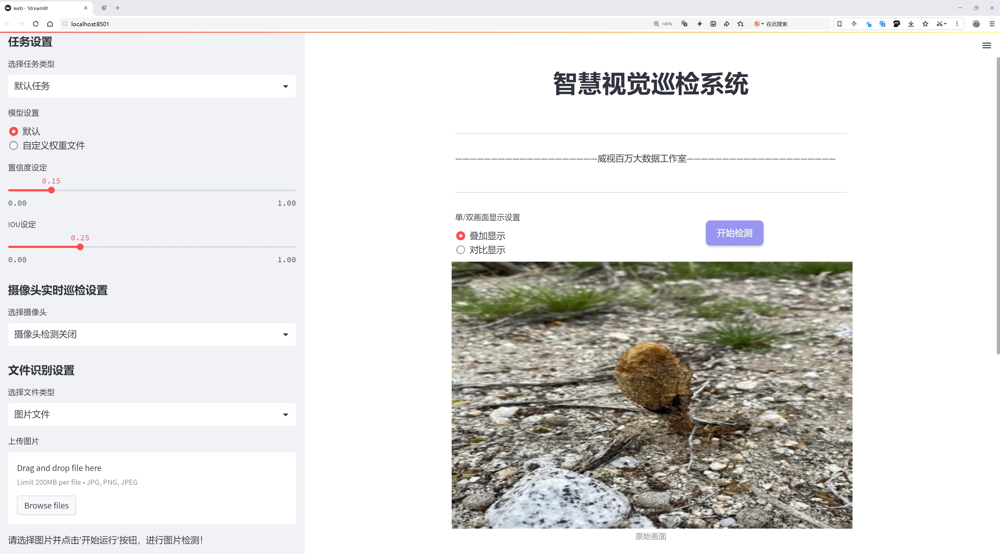
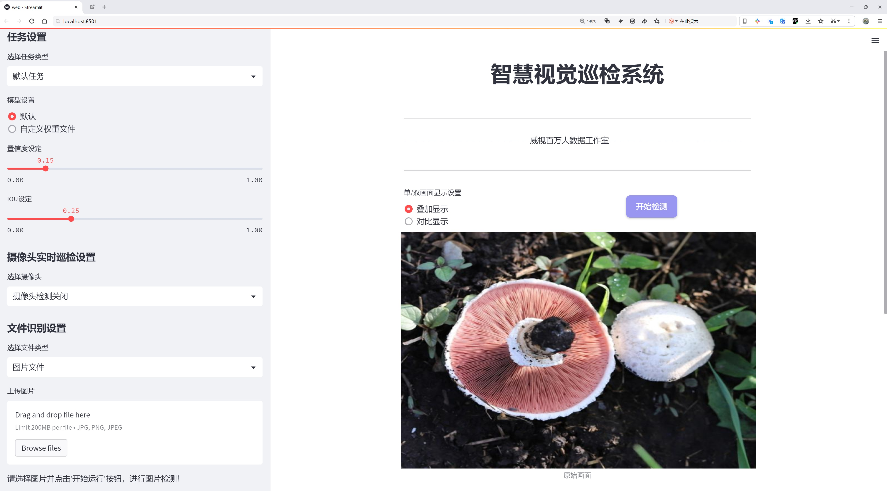
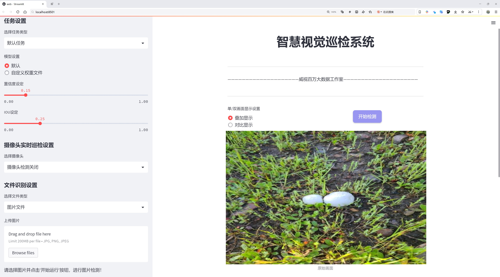
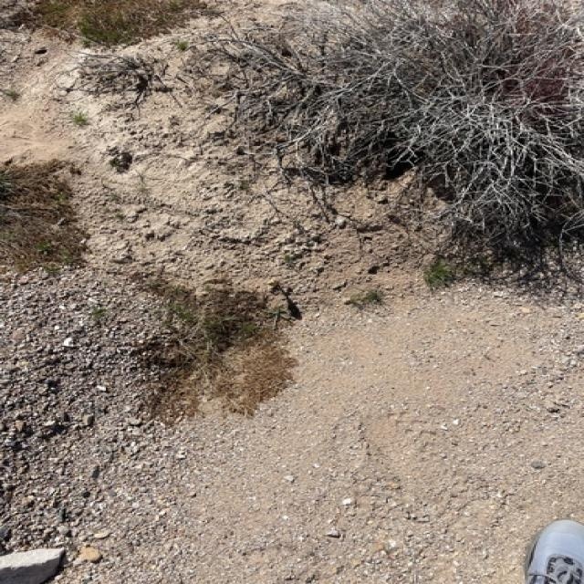
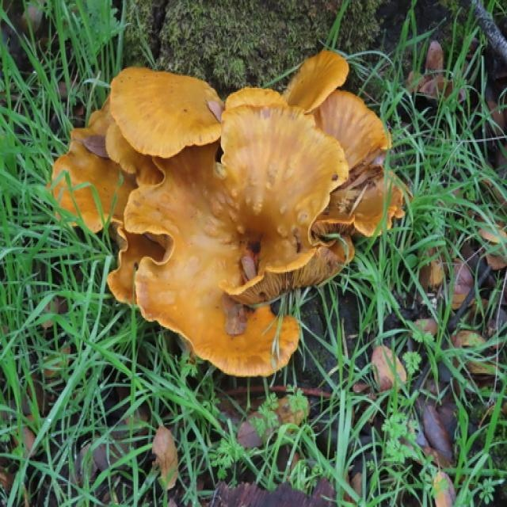
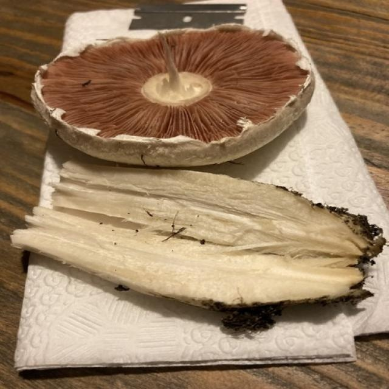
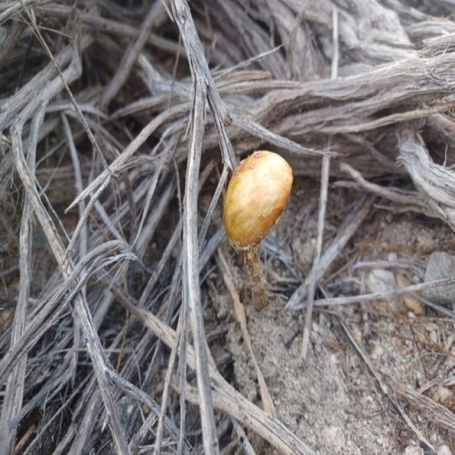

# 蘑菇种类检测系统源码分享
 # [一条龙教学YOLOV8标注好的数据集一键训练_70+全套改进创新点发刊_Web前端展示]

### 1.研究背景与意义

项目参考[AAAI Association for the Advancement of Artificial Intelligence](https://gitee.com/qunmasj/projects)

项目来源[AACV Association for the Advancement of Computer Vision](https://github.com/qunshansj/good)

研究背景与意义

蘑菇作为一种重要的食用和药用菌类，因其丰富的营养价值和独特的风味而受到广泛关注。然而，蘑菇的种类繁多，形态各异，且许多种类在外观上极为相似，这给蘑菇的识别和分类带来了极大的挑战。传统的蘑菇分类方法主要依赖于专家的经验和人工观察，效率低下且容易受到主观因素的影响。因此，开发一种高效、准确的蘑菇种类识别系统显得尤为重要。

近年来，深度学习技术的迅猛发展为图像识别领域带来了革命性的变化，尤其是在物体检测方面。YOLO（You Only Look Once）系列模型因其实时性和高准确率而广泛应用于各种视觉识别任务。YOLOv8作为该系列的最新版本，进一步提升了模型的性能和效率，具备了更强的特征提取能力和更快的推理速度。基于YOLOv8的蘑菇种类识别系统的构建，不仅能够提高蘑菇分类的准确性，还能在实际应用中实现实时检测，为蘑菇的安全食用和科学研究提供重要支持。

本研究所使用的数据集包含3019张图像，涵盖了13个蘑菇种类，包括常见的食用蘑菇和一些具有毒性的品种。数据集的多样性和丰富性为模型的训练提供了良好的基础，使得模型能够学习到不同种类蘑菇的特征。这些种类的蘑菇在生态系统中扮演着重要角色，了解它们的分类和特征不仅有助于提高人们对蘑菇的认识，还能促进生物多样性的保护和可持续利用。

通过改进YOLOv8模型，我们希望能够在蘑菇种类识别中实现更高的准确率和更快的处理速度。这一研究不仅具有重要的理论意义，还具有广泛的应用前景。首先，在食品安全领域，准确识别食用蘑菇和有毒蘑菇能够有效减少误食事件的发生，保障公众的健康安全。其次，在生态研究中，快速准确的蘑菇种类识别能够为生态监测和生物多样性研究提供重要的数据支持，促进对生态系统的深入理解。此外，该系统还可以应用于农业生产，帮助农民识别和管理蘑菇种植，提高生产效率。

综上所述，基于改进YOLOv8的蘑菇种类识别系统的研究，不仅能够推动计算机视觉技术在生物分类中的应用，还能为食品安全、生态保护和农业发展提供切实的解决方案，具有重要的学术价值和社会意义。通过本研究，我们期望能够为蘑菇种类的快速识别和分类提供一种新思路，推动相关领域的进一步发展。

### 2.图片演示







##### 注意：由于此博客编辑较早，上面“2.图片演示”和“3.视频演示”展示的系统图片或者视频可能为老版本，新版本在老版本的基础上升级如下：（实际效果以升级的新版本为准）

  （1）适配了YOLOV8的“目标检测”模型和“实例分割”模型，通过加载相应的权重（.pt）文件即可自适应加载模型。

  （2）支持“图片识别”、“视频识别”、“摄像头实时识别”三种识别模式。

  （3）支持“图片识别”、“视频识别”、“摄像头实时识别”三种识别结果保存导出，解决手动导出（容易卡顿出现爆内存）存在的问题，识别完自动保存结果并导出到tempDir中。

  （4）支持Web前端系统中的标题、背景图等自定义修改，后面提供修改教程。

  另外本项目提供训练的数据集和训练教程,暂不提供权重文件（best.pt）,需要您按照教程进行训练后实现图片演示和Web前端界面演示的效果。

### 3.视频演示

[3.1 视频演示](https://www.bilibili.com/video/BV12opYepE4Y/)

### 4.数据集信息展示

##### 4.1 本项目数据集详细数据（类别数＆类别名）

nc: 12
names: ['-', 'Agaricus campestris', 'Agrocybe pediades', 'Amanita muscaria', 'Amanita velosa', 'Bovista plumbea', 'Cryptoporus volvatus', 'Gymnopus dryophilus', 'Omphalotus olivascens', 'Pholiota aurivella', 'Podaxis pistillaris', 'Volvopluteus gloiocephalus']


##### 4.2 本项目数据集信息介绍

数据集信息展示

在本研究中，我们采用了名为“Procesamiento”的数据集，以训练和改进YOLOv8模型，旨在实现对不同蘑菇种类的准确识别和分类。该数据集的设计充分考虑了蘑菇种类的多样性与复杂性，包含了12个不同的类别，每个类别代表一种特定的蘑菇。数据集的类别列表包括：Agaricus campestris、Agrocybe pediades、Amanita muscaria、Amanita velosa、Bovista plumbea、Cryptoporus volvatus、Gymnopus dryophilus、Omphalotus olivascens、Pholiota aurivella、Podaxis pistillaris以及Volvopluteus gloiocephalus。这些蘑菇种类在生态系统中扮演着重要的角色，既有食用价值，也有可能对人类健康构成威胁，因此准确识别它们具有重要的实际意义。

“Procesamiento”数据集的构建过程中，研究团队注重数据的多样性和代表性，确保每个类别都包含了丰富的样本。这些样本不仅涵盖了不同生长环境下的蘑菇，还考虑了不同生长阶段、不同光照条件以及不同拍摄角度等因素。这种多样性使得模型在训练过程中能够学习到更为全面的特征，从而提高其在实际应用中的泛化能力。

在数据集的标注过程中，采用了高标准的标注规范，确保每个样本的类别标注准确无误。每个蘑菇样本都经过专业的生物学家进行确认，以确保数据的真实性和可靠性。这一过程不仅提高了数据集的质量，也为后续的模型训练提供了坚实的基础。

通过对“Procesamiento”数据集的深入分析，我们发现不同蘑菇种类在形态特征上存在显著差异。例如，Amanita muscaria以其鲜艳的红色和白色斑点而闻名，而Agaricus campestris则呈现出较为朴素的外观。这些形态特征的差异为YOLOv8模型的训练提供了丰富的特征学习空间，使其能够在识别过程中更好地捕捉到这些细微的差别。

此外，数据集还包含了大量的背景信息和环境数据，这为模型的训练提供了更多的上下文信息。例如，某些蘑菇种类更倾向于在特定的土壤类型或气候条件下生长，这些信息可以帮助模型在实际应用中进行更为准确的判断。通过将这些环境因素与蘑菇的外观特征结合，YOLOv8模型能够在复杂的环境中实现更高的识别准确率。

总之，“Procesamiento”数据集为我们改进YOLOv8模型提供了一个极为丰富和多样化的训练基础。通过对不同蘑菇种类的深入学习和分析，我们期望能够提升模型在实际应用中的表现，最终实现对蘑菇种类的高效、准确识别。这不仅有助于推动蘑菇分类技术的发展，也为相关领域的研究提供了新的思路和方向。










### 5.全套项目环境部署视频教程（零基础手把手教学）

[5.1 环境部署教程链接（零基础手把手教学）](https://www.ixigua.com/7404473917358506534?logTag=c807d0cbc21c0ef59de5)


[5.2 安装Python虚拟环境创建和依赖库安装视频教程链接（零基础手把手教学）](https://www.ixigua.com/7404474678003106304?logTag=1f1041108cd1f708b01a)

### 6.手把手YOLOV8训练视频教程（零基础小白有手就能学会）

[6.1 环境部署教程链接（零基础手把手教学）](https://www.ixigua.com/7404477157818401292?logTag=d31a2dfd1983c9668658)

### 7.70+种全套YOLOV8创新点代码加载调参视频教程（一键加载写好的改进模型的配置文件）

[7.1 环境部署教程链接（零基础手把手教学）](https://www.ixigua.com/7404478314661806627?logTag=29066f8288e3f4eea3a4)

### 8.70+种全套YOLOV8创新点原理讲解（非科班也可以轻松写刊发刊，V10版本正在科研待更新）

由于篇幅限制，每个创新点的具体原理讲解就不一一展开，具体见下列网址中的创新点对应子项目的技术原理博客网址【Blog】：


[8.1 70+种全套YOLOV8创新点原理讲解链接](https://gitee.com/qunmasj/good)

### 9.系统功能展示（检测对象为举例，实际内容以本项目数据集为准）

图9.1.系统支持检测结果表格显示

  图9.2.系统支持置信度和IOU阈值手动调节

  图9.3.系统支持自定义加载权重文件best.pt(需要你通过步骤5中训练获得)

  图9.4.系统支持摄像头实时识别

  图9.5.系统支持图片识别

  图9.6.系统支持视频识别

  图9.7.系统支持识别结果文件自动保存

  图9.8.系统支持Excel导出检测结果数据


### 10.原始YOLOV8算法原理

原始YOLOv8算法原理

YOLOv8作为YOLO系列的最新版本，代表了目标检测领域中的一项重要进展。其设计理念不仅延续了YOLO系列的高效性和实时性，还在此基础上进行了多项创新和改进，使得模型在性能和灵活性上有了显著提升。YOLOv8s模型的架构主要由三个核心部分组成：Backbone、Neck和Head，每个部分在整体功能中扮演着不可或缺的角色。

在Backbone部分，YOLOv8s采用了CSPDarknet（Cross Stage Partial Darknet）结构，这是一个经过优化的特征提取网络。CSPDarknet的设计将网络分为两个部分，每个部分都包含多个残差块，这种结构的引入有效地提高了特征提取的效率。与前代模型YOLOv5相比，YOLOv8s用C2f模块替代了C3模块。C2f模块的创新在于它将输入的特征图分成两个分支，分别经过卷积层进行降维处理，这种分支结构不仅增加了网络的灵活性，还使得特征图的维度得以提升。此外，C2f模块中引入的v8_C2fBottleneck层也极大地增强了特征的表达能力，输出的特征图经过进一步的卷积融合，形成了更高维度的特征图，从而使得模型能够捕捉到更丰富的梯度流信息。

在特征提取的过程中，YOLOv8s还引入了快速空间金字塔池化（SPPF）结构。SPPF的设计旨在提取不同尺度的特征，这一结构的优势在于能够有效减少模型的参数量和计算量，同时提升特征提取的效率。通过这种多尺度特征提取方式，YOLOv8s能够更好地应对各种目标的检测任务，无论是小目标还是大目标，模型都能保持较高的检测准确度。

接下来是Neck部分，它采用了特征金字塔网络（FPN）与路径聚合网络（PAN）的结合。这一结构的设计目的是将来自Backbone不同阶段的特征图进行融合，以便更好地捕捉不同尺度目标的信息。通过多层次的特征融合，YOLOv8s在处理复杂场景时表现出更强的鲁棒性和准确性。Neck部分的卷积层和池化层不仅有效地压缩了特征图，还增强了模型对目标的检测能力。

最后是Head部分，负责最终的目标检测和分类任务。YOLOv8s的Head设计包含三个检测头，分别用于处理不同尺寸的目标信息。每个检测头内部由一系列卷积层和反卷积层构成，负责将经过Neck处理后的特征图转换为最终的检测结果。值得注意的是，YOLOv8s采用了一种基于无锚框（Anchor-Free）的检测方式。这种方法直接预测目标的中心点和宽高比例，避免了传统Anchor框的设计，使得模型在检测速度和准确度上都得到了显著提升。

在YOLOv8的设计中，整体架构的优化和各个模块的创新相辅相成，使得该模型在目标检测任务中展现出强大的性能。YOLOv8不仅在准确性上有了显著提高，其实时性也得到了保障，能够满足各种应用场景的需求。通过对Backbone、Neck和Head的精心设计，YOLOv8实现了特征提取与目标检测的高效结合，为目标检测技术的发展提供了新的思路和方向。

总的来说，YOLOv8s作为YOLO系列的最新代表，凭借其高效的特征提取和目标检测能力，已经成为目标检测领域的重要工具。其引入的多项创新设计，使得YOLOv8s在处理复杂场景和多尺度目标时，展现出优越的性能和灵活性。随着YOLOv8的不断发展和完善，未来在智能监控、自动驾驶、无人机视觉等多个领域的应用前景将更加广阔。


### 11.项目核心源码讲解（再也不用担心看不懂代码逻辑）

#### 11.1 ui.py

以下是代码的核心部分，并附上详细的中文注释：

```python
import sys
import subprocess

def run_script(script_path):
    """
    使用当前 Python 环境运行指定的脚本。

    Args:
        script_path (str): 要运行的脚本路径

    Returns:
        None
    """
    # 获取当前 Python 解释器的路径
    python_path = sys.executable

    # 构建运行命令，使用 streamlit 运行指定的脚本
    command = f'"{python_path}" -m streamlit run "{script_path}"'

    # 执行命令，并等待其完成
    result = subprocess.run(command, shell=True)
    
    # 检查命令执行的返回码，若不为0则表示出错
    if result.returncode != 0:
        print("脚本运行出错。")

# 实例化并运行应用
if __name__ == "__main__":
    # 指定要运行的脚本路径
    script_path = "web.py"  # 这里可以直接使用脚本名，假设它在当前目录下

    # 调用函数运行脚本
    run_script(script_path)
```

### 代码分析：
1. **导入模块**：
   - `sys`：用于获取当前 Python 解释器的路径。
   - `subprocess`：用于执行外部命令。

2. **`run_script` 函数**：
   - 该函数接受一个参数 `script_path`，表示要运行的 Python 脚本的路径。
   - 使用 `sys.executable` 获取当前 Python 解释器的路径。
   - 构建一个命令字符串，使用 `streamlit` 运行指定的脚本。
   - 使用 `subprocess.run` 执行构建的命令，并等待其完成。
   - 检查命令的返回码，如果返回码不为0，表示脚本运行出错，打印错误信息。

3. **主程序部分**：
   - 使用 `if __name__ == "__main__":` 确保该代码块只在直接运行脚本时执行。
   - 指定要运行的脚本路径（在这里是 `web.py`）。
   - 调用 `run_script` 函数，传入脚本路径以执行该脚本。 

### 总结：
该代码的核心功能是通过当前 Python 环境运行指定的 `streamlit` 脚本，并处理可能出现的错误。

这个程序文件 `ui.py` 的主要功能是通过当前的 Python 环境来运行一个指定的脚本，具体来说是一个名为 `web.py` 的脚本。程序首先导入了必要的模块，包括 `sys`、`os` 和 `subprocess`，这些模块分别用于获取系统信息、操作系统功能和执行外部命令。

在 `run_script` 函数中，首先获取当前 Python 解释器的路径，这通过 `sys.executable` 实现。接着，构建一个命令字符串，该命令用于调用 `streamlit` 模块并运行指定的脚本。`streamlit` 是一个用于构建数据应用的框架，命令的格式是将 Python 解释器和脚本路径组合在一起。

然后，使用 `subprocess.run` 方法执行这个命令。该方法会在一个新的 shell 中运行命令，并返回一个结果对象。通过检查 `result.returncode`，可以判断脚本是否成功运行。如果返回码不为零，说明脚本运行过程中出现了错误，此时程序会输出一条错误信息。

在文件的最后部分，使用 `if __name__ == "__main__":` 语句来确保只有在直接运行该文件时才会执行下面的代码。这部分代码指定了要运行的脚本路径，这里使用了 `abs_path` 函数来获取 `web.py` 的绝对路径。最后，调用 `run_script` 函数来执行这个脚本。

总体来说，这个文件的主要作用是作为一个启动器，方便用户通过 Python 环境来运行一个 Streamlit 应用。

#### 11.2 ultralytics\models\sam\predict.py

以下是代码中最核心的部分，并附上详细的中文注释：

```python
class Predictor(BasePredictor):
    """
    Segment Anything Model (SAM) 的预测器类，继承自 BasePredictor。

    该类提供了一个接口，用于针对图像分割任务进行模型推理。
    具备先进的架构和可提示的分割能力，支持灵活的实时掩膜生成。
    可以处理多种类型的提示，例如边界框、点和低分辨率掩膜。
    """

    def __init__(self, cfg=DEFAULT_CFG, overrides=None, _callbacks=None):
        """
        初始化预测器，设置配置、覆盖和回调。

        Args:
            cfg (dict): 配置字典。
            overrides (dict, optional): 覆盖默认配置的值的字典。
            _callbacks (dict, optional): 自定义回调函数的字典。
        """
        if overrides is None:
            overrides = {}
        overrides.update(dict(task="segment", mode="predict", imgsz=1024))
        super().__init__(cfg, overrides, _callbacks)
        self.args.retina_masks = True  # 启用视网膜掩膜
        self.im = None  # 输入图像
        self.features = None  # 提取的图像特征
        self.prompts = {}  # 提示集合
        self.segment_all = False  # 是否分割所有对象的标志

    def preprocess(self, im):
        """
        对输入图像进行预处理，以便进行模型推理。

        Args:
            im (torch.Tensor | List[np.ndarray]): BCHW格式的张量或HWC格式的numpy数组列表。

        Returns:
            (torch.Tensor): 预处理后的图像张量。
        """
        if self.im is not None:
            return self.im  # 如果已经处理过，直接返回
        not_tensor = not isinstance(im, torch.Tensor)
        if not_tensor:
            im = np.stack(self.pre_transform(im))  # 预转换
            im = im[..., ::-1].transpose((0, 3, 1, 2))  # 颜色通道转换
            im = np.ascontiguousarray(im)
            im = torch.from_numpy(im)  # 转换为张量

        im = im.to(self.device)  # 移动到指定设备
        im = im.half() if self.model.fp16 else im.float()  # 根据模型设置转换数据类型
        if not_tensor:
            im = (im - self.mean) / self.std  # 归一化
        return im

    def inference(self, im, bboxes=None, points=None, labels=None, masks=None, multimask_output=False, *args, **kwargs):
        """
        基于给定的输入提示执行图像分割推理。

        Args:
            im (torch.Tensor): 预处理后的输入图像张量，形状为 (N, C, H, W)。
            bboxes (np.ndarray | List, optional): 边界框，形状为 (N, 4)，XYXY格式。
            points (np.ndarray | List, optional): 指示对象位置的点，形状为 (N, 2)，像素坐标。
            labels (np.ndarray | List, optional): 点提示的标签，形状为 (N, )。1表示前景，0表示背景。
            masks (np.ndarray, optional): 先前预测的低分辨率掩膜，形状应为 (N, H, W)，对于SAM，H=W=256。
            multimask_output (bool, optional): 返回多个掩膜的标志。对模糊提示有帮助。默认为False。

        Returns:
            (tuple): 包含以下三个元素的元组。
                - np.ndarray: 输出掩膜，形状为 CxHxW，其中 C 是生成的掩膜数量。
                - np.ndarray: 长度为 C 的数组，包含模型为每个掩膜预测的质量分数。
                - np.ndarray: 形状为 CxHxW 的低分辨率logits，用于后续推理，H=W=256。
        """
        # 如果self.prompts中有存储的提示，则覆盖
        bboxes = self.prompts.pop("bboxes", bboxes)
        points = self.prompts.pop("points", points)
        masks = self.prompts.pop("masks", masks)

        if all(i is None for i in [bboxes, points, masks]):
            return self.generate(im, *args, **kwargs)  # 如果没有提示，生成掩膜

        return self.prompt_inference(im, bboxes, points, labels, masks, multimask_output)  # 基于提示进行推理

    def generate(self, im, crop_n_layers=0, crop_overlap_ratio=512 / 1500, crop_downscale_factor=1, 
                 point_grids=None, points_stride=32, points_batch_size=64, conf_thres=0.88, 
                 stability_score_thresh=0.95, stability_score_offset=0.95, crop_nms_thresh=0.7):
        """
        使用Segment Anything Model (SAM)执行图像分割。

        Args:
            im (torch.Tensor): 输入张量，表示预处理后的图像，维度为 (N, C, H, W)。
            crop_n_layers (int): 指定用于图像裁剪的额外掩膜预测的层数。
            crop_overlap_ratio (float): 裁剪之间的重叠程度。
            crop_downscale_factor (int): 每层中采样点的缩放因子。
            point_grids (list[np.ndarray], optional): 自定义点采样网格，归一化到 [0,1]。
            points_stride (int, optional): 沿图像每边采样的点数。
            points_batch_size (int): 同时处理的点的批量大小。
            conf_thres (float): 根据模型的掩膜质量预测进行过滤的置信度阈值。
            stability_score_thresh (float): 基于掩膜稳定性进行过滤的稳定性阈值。
            stability_score_offset (float): 计算稳定性分数的偏移值。
            crop_nms_thresh (float): 用于去除裁剪之间重复掩膜的非最大抑制（NMS）的IoU截止值。

        Returns:
            (tuple): 包含分割掩膜、置信度分数和边界框的元组。
        """
        self.segment_all = True  # 设置为分割所有对象
        ih, iw = im.shape[2:]  # 获取输入图像的高度和宽度
        crop_regions, layer_idxs = generate_crop_boxes((ih, iw), crop_n_layers, crop_overlap_ratio)  # 生成裁剪区域
        if point_grids is None:
            point_grids = build_all_layer_point_grids(points_stride, crop_n_layers, crop_downscale_factor)  # 构建点网格
        pred_masks, pred_scores, pred_bboxes, region_areas = [], [], [], []  # 初始化预测结果

        # 遍历每个裁剪区域
        for crop_region, layer_idx in zip(crop_regions, layer_idxs):
            x1, y1, x2, y2 = crop_region  # 获取裁剪区域的坐标
            w, h = x2 - x1, y2 - y1  # 计算裁剪区域的宽和高
            area = torch.tensor(w * h, device=im.device)  # 计算区域面积
            points_scale = np.array([[w, h]])  # 裁剪区域的宽高比例

            # 裁剪图像并插值到输入大小
            crop_im = F.interpolate(im[..., y1:y2, x1:x2], (ih, iw), mode="bilinear", align_corners=False)
            points_for_image = point_grids[layer_idx] * points_scale  # 根据裁剪区域缩放点

            crop_masks, crop_scores, crop_bboxes = [], [], []  # 初始化裁剪结果
            for (points,) in batch_iterator(points_batch_size, points_for_image):  # 批量处理点
                pred_mask, pred_score = self.prompt_inference(crop_im, points=points, multimask_output=True)  # 推理
                pred_mask = F.interpolate(pred_mask[None], (h, w), mode="bilinear", align_corners=False)[0]  # 插值掩膜
                idx = pred_score > conf_thres  # 根据置信度阈值过滤掩膜
                pred_mask, pred_score = pred_mask[idx], pred_score[idx]

                stability_score = calculate_stability_score(pred_mask, self.model.mask_threshold, stability_score_offset)  # 计算稳定性分数
                idx = stability_score > stability_score_thresh  # 根据稳定性阈值过滤掩膜
                pred_mask, pred_score = pred_mask[idx], pred_score[idx]
                pred_mask = pred_mask > self.model.mask_threshold  # 转换为布尔类型掩膜
                pred_bbox = batched_mask_to_box(pred_mask).float()  # 计算边界框
                keep_mask = ~is_box_near_crop_edge(pred_bbox, crop_region, [0, 0, iw, ih])  # 过滤靠近裁剪边缘的框
                if not torch.all(keep_mask):
                    pred_bbox, pred_mask, pred_score = pred_bbox[keep_mask], pred_mask[keep_mask], pred_score[keep_mask]

                crop_masks.append(pred_mask)  # 添加掩膜
                crop_bboxes.append(pred_bbox)  # 添加边界框
                crop_scores.append(pred_score)  # 添加分数

            # 在此裁剪区域内执行NMS
            crop_masks = torch.cat(crop_masks)  # 合并掩膜
            crop_bboxes = torch.cat(crop_bboxes)  # 合并边界框
            crop_scores = torch.cat(crop_scores)  # 合并分数
            keep = torchvision.ops.nms(crop_bboxes, crop_scores, self.args.iou)  # NMS
            crop_bboxes = uncrop_boxes_xyxy(crop_bboxes[keep], crop_region)  # 解裁剪边界框
            crop_masks = uncrop_masks(crop_masks[keep], crop_region, ih, iw)  # 解裁剪掩膜
            crop_scores = crop_scores[keep]  # 保留分数

            pred_masks.append(crop_masks)  # 添加裁剪掩膜
            pred_bboxes.append(crop_bboxes)  # 添加裁剪边界框
            pred_scores.append(crop_scores)  # 添加裁剪分数
            region_areas.append(area.expand(len(crop_masks)))  # 添加区域面积

        pred_masks = torch.cat(pred_masks)  # 合并所有掩膜
        pred_bboxes = torch.cat(pred_bboxes)  # 合并所有边界框
        pred_scores = torch.cat(pred_scores)  # 合并所有分数
        region_areas = torch.cat(region_areas)  # 合并所有区域面积

        # 移除裁剪之间的重复掩膜
        if len(crop_regions) > 1:
            scores = 1 / region_areas  # 计算分数
            keep = torchvision.ops.nms(pred_bboxes, scores, crop_nms_thresh)  # NMS
            pred_masks, pred_bboxes, pred_scores = pred_masks[keep], pred_bboxes[keep], pred_scores[keep]

        return pred_masks, pred_scores, pred_bboxes  # 返回最终结果
```

### 代码核心部分说明：
1. **类的定义**：`Predictor`类用于处理图像分割任务，继承自`BasePredictor`，提供了模型推理的接口。
2. **初始化方法**：设置模型的配置、覆盖和回调，初始化输入图像、特征和提示等。
3. **预处理方法**：对输入图像进行预处理，包括转换为张量、归一化等。
4. **推理方法**：根据输入提示执行图像分割推理，支持多种提示类型。
5. **生成方法**：执行图像分割，支持裁剪区域处理和多掩膜输出，返回最终的掩膜、分数和边界框。

这些核心部分构成了图像分割的基础逻辑，能够处理输入图像并生成相应的分割结果。

这个程序文件 `ultralytics\models\sam\predict.py` 是用于实现 Segment Anything Model (SAM) 的预测逻辑，主要用于图像分割任务。SAM 是一种先进的图像分割模型，具有可提示的分割和零样本性能。该模块包含了执行分割所需的预测逻辑和辅助工具，旨在支持高性能的实时图像分割任务。

文件中首先导入了一些必要的库，包括 NumPy、PyTorch 和 torchvision，以及 Ultralytics 框架中的一些工具和功能。接着定义了一个 `Predictor` 类，该类继承自 `BasePredictor`，为图像分割任务提供了模型推理的接口。该类支持多种提示类型，如边界框、点和低分辨率掩码，并能够灵活地生成实时掩码。

在 `Predictor` 类的构造函数中，初始化了一些属性，包括配置字典、覆盖的参数、回调函数等。还设置了一些与任务相关的设置，如 `retina_masks` 为 True，以获得最佳结果。

`preprocess` 方法用于对输入图像进行预处理，支持将图像转换为 PyTorch 张量格式，并进行归一化处理。`pre_transform` 方法则对输入图像进行初步的变换，如调整大小，以便后续处理。

`inference` 方法是进行图像分割推理的核心函数，基于给定的输入提示（如边界框、点等）进行分割。该方法会调用 `prompt_inference` 函数，后者利用 SAM 的架构进行实时和可提示的分割。

`generate` 方法则用于对整个图像进行分割，支持在图像裁剪上进行更精细的分割。该方法会生成裁剪区域，并在每个裁剪区域内进行推理，最后将结果合并。

`setup_model` 方法用于初始化 SAM 模型，将其分配到适当的设备，并设置图像归一化所需的参数。`postprocess` 方法用于对模型的输出进行后处理，生成对象检测掩码和边界框，并将掩码和框缩放到原始图像大小。

此外，`setup_source` 方法用于配置推理的数据源，`set_image` 方法用于设置单张图像进行推理，`set_prompts` 方法用于提前设置提示信息，`reset_image` 方法则重置图像和特征。

最后，`remove_small_regions` 方法用于对生成的分割掩码进行后处理，去除小的孤立区域和孔洞，并执行非极大值抑制（NMS）以消除重复的边界框。

整体来看，这个文件提供了一个完整的框架，用于利用 SAM 模型进行高效的图像分割，支持多种输入提示方式，并提供了必要的预处理和后处理功能。

#### 11.3 ultralytics\utils\tuner.py

以下是代码中最核心的部分，并附上详细的中文注释：

```python
import subprocess
from ultralytics.utils import LOGGER, NUM_THREADS
from ray import tune
from ray.air import RunConfig
from ray.tune.schedulers import ASHAScheduler
from ray.air.integrations.wandb import WandbLoggerCallback

def run_ray_tune(
    model, space: dict = None, grace_period: int = 10, gpu_per_trial: int = None, max_samples: int = 10, **train_args
):
    """
    使用 Ray Tune 进行超参数调优。

    参数:
        model (YOLO): 要进行调优的模型。
        space (dict, optional): 超参数搜索空间。默认为 None。
        grace_period (int, optional): ASHA 调度器的宽限期（以 epochs 为单位）。默认为 10。
        gpu_per_trial (int, optional): 每个试验分配的 GPU 数量。默认为 None。
        max_samples (int, optional): 要运行的最大试验次数。默认为 10。
        train_args (dict, optional): 传递给 `train()` 方法的其他参数。默认为 {}。

    返回:
        (dict): 包含超参数搜索结果的字典。
    """

    # 日志记录 Ray Tune 的学习链接
    LOGGER.info("💡 Learn about RayTune at https://docs.ultralytics.com/integrations/ray-tune")

    # 安装 Ray Tune 库
    subprocess.run("pip install ray[tune]".split(), check=True)

    # 定义默认的超参数搜索空间
    default_space = {
        "lr0": tune.uniform(1e-5, 1e-1),  # 初始学习率
        "lrf": tune.uniform(0.01, 1.0),  # 最终学习率的比例
        "momentum": tune.uniform(0.6, 0.98),  # 动量
        "weight_decay": tune.uniform(0.0, 0.001),  # 权重衰减
        "warmup_epochs": tune.uniform(0.0, 5.0),  # 预热 epochs
        "box": tune.uniform(0.02, 0.2),  # 边框损失增益
        "cls": tune.uniform(0.2, 4.0),  # 分类损失增益
        # 其他数据增强参数...
    }

    # 将模型放入 Ray 存储中
    model_in_store = ray.put(model)

    def _tune(config):
        """
        使用指定的超参数和其他参数训练 YOLO 模型。

        参数:
            config (dict): 用于训练的超参数字典。

        返回:
            None.
        """
        model_to_train = ray.get(model_in_store)  # 从 Ray 存储中获取模型
        model_to_train.reset_callbacks()  # 重置回调
        config.update(train_args)  # 更新训练参数
        results = model_to_train.train(**config)  # 训练模型
        return results.results_dict  # 返回结果字典

    # 获取搜索空间
    if not space:
        space = default_space  # 如果没有提供搜索空间，则使用默认空间

    # 定义可训练函数并分配资源
    trainable_with_resources = tune.with_resources(_tune, {"cpu": NUM_THREADS, "gpu": gpu_per_trial or 0})

    # 定义 ASHA 调度器
    asha_scheduler = ASHAScheduler(
        time_attr="epoch",
        metric="metric_name",  # 需要根据任务定义的指标
        mode="max",
        max_t=100,  # 最大训练 epochs
        grace_period=grace_period,
        reduction_factor=3,
    )

    # 定义 Ray Tune 超参数搜索调优器
    tuner = tune.Tuner(
        trainable_with_resources,
        param_space=space,
        tune_config=tune.TuneConfig(scheduler=asha_scheduler, num_samples=max_samples),
        run_config=RunConfig(callbacks=[], storage_path="tune_dir"),  # 存储路径
    )

    # 运行超参数搜索
    tuner.fit()

    # 返回超参数搜索的结果
    return tuner.get_results()
```

### 代码核心部分说明：
1. **导入必要的库**：导入了用于超参数调优的 Ray Tune 相关库和其他工具。
2. **定义 `run_ray_tune` 函数**：该函数是进行超参数调优的主要入口，接受模型、超参数空间、训练参数等。
3. **安装 Ray Tune**：确保环境中安装了 Ray Tune。
4. **定义默认超参数空间**：设置了模型训练中可能需要调整的超参数的范围。
5. **定义 `_tune` 函数**：该函数负责使用给定的超参数训练模型，并返回训练结果。
6. **设置调度器和调优器**：使用 ASHA 调度器来管理超参数搜索过程，并定义调优器来执行搜索。
7. **运行超参数搜索**：调用 `tuner.fit()` 开始搜索，并返回结果。

这个程序文件 `ultralytics/utils/tuner.py` 是用于在 Ultralytics YOLO 框架中进行超参数调优的工具。该文件的核心功能是通过 Ray Tune 库来优化模型的超参数，从而提高模型的性能。

程序首先导入了必要的模块，包括 `subprocess` 用于执行系统命令，以及一些来自 `ultralytics` 的配置和工具函数。接着定义了一个名为 `run_ray_tune` 的函数，该函数接受多个参数，其中包括模型、超参数搜索空间、训练参数等。

函数的主要目的是执行超参数调优。它首先会输出一条信息，提示用户了解 Ray Tune 的文档。接着，程序尝试安装 Ray Tune 库，如果安装失败则抛出异常。随后，程序会导入 Ray 和 Tune 相关的模块，以及 Wandb（Weights & Biases）用于记录实验的结果。

在超参数的定义部分，程序设定了一些默认的超参数搜索空间，包括学习率、动量、权重衰减等。这些超参数对于模型的训练过程至关重要，合适的值可以显著提升模型的性能。

程序接下来将模型放入 Ray 的存储中，并定义了一个内部函数 `_tune`，该函数负责使用给定的超参数配置训练模型，并返回训练结果。然后，程序会检查是否提供了超参数搜索空间，如果没有，则使用默认的搜索空间，并发出警告。

接着，程序获取数据集信息，并将其添加到超参数空间中。如果没有提供数据集，程序会使用默认的数据集并发出警告。

然后，程序定义了一个可训练的函数，并指定了资源分配，包括 CPU 和 GPU 的数量。接下来，程序设置了 ASHA 调度器，用于管理超参数搜索的过程，并定义了用于记录的回调函数（如果使用 Wandb）。

最后，程序创建了一个 Ray Tune 的超参数搜索调优器，并指定了参数空间、调度器和回调函数。通过调用 `tuner.fit()`，程序开始执行超参数搜索，最终返回搜索结果。

总的来说，这个文件提供了一个高效的方式来优化 YOLO 模型的超参数，使得用户能够通过简单的接口进行复杂的调优过程。

#### 11.4 train.py

以下是代码中最核心的部分，并附上详细的中文注释：

```python
import os
import torch
import yaml
from ultralytics import YOLO  # 导入YOLO模型
from QtFusion.path import abs_path  # 导入路径处理函数

# 检测是否有可用的GPU，如果有则使用GPU，否则使用CPU
device = "0" if torch.cuda.is_available() else "cpu"

if __name__ == '__main__':  # 确保该模块被直接运行时才执行以下代码
    workers = 1  # 设置数据加载的工作进程数
    batch = 2    # 设置每个批次的大小

    data_name = "data"  # 数据集名称
    # 获取数据集yaml文件的绝对路径
    data_path = abs_path(f'datasets/{data_name}/{data_name}.yaml', path_type='current')  
    unix_style_path = data_path.replace(os.sep, '/')  # 将路径转换为Unix风格

    # 获取数据集目录路径
    directory_path = os.path.dirname(unix_style_path)
    
    # 读取YAML文件，保持原有顺序
    with open(data_path, 'r') as file:
        data = yaml.load(file, Loader=yaml.FullLoader)
    
    # 如果YAML文件中包含'path'项，则修改为当前目录路径
    if 'path' in data:
        data['path'] = directory_path
        # 将修改后的数据写回YAML文件
        with open(data_path, 'w') as file:
            yaml.safe_dump(data, file, sort_keys=False)

    # 加载预训练的YOLOv8模型
    model = YOLO(model='./ultralytics/cfg/models/v8/yolov8s.yaml', task='detect')  
    
    # 开始训练模型
    results2 = model.train(
        data=data_path,  # 指定训练数据的配置文件路径
        device=device,  # 指定使用的设备（GPU或CPU）
        workers=workers,  # 指定使用的工作进程数
        imgsz=640,  # 指定输入图像的大小为640x640
        epochs=100,  # 指定训练100个epoch
        batch=batch,  # 指定每个批次的大小
        name='train_v8_' + data_name  # 指定训练任务的名称
    )
```

### 代码说明：
1. **导入库**：导入必要的库，包括`os`、`torch`、`yaml`和YOLO模型。
2. **设备选择**：通过`torch.cuda.is_available()`检查是否有可用的GPU，并相应地设置设备。
3. **数据集路径处理**：构建数据集的绝对路径，并确保路径格式为Unix风格。
4. **读取和修改YAML文件**：读取YAML文件，修改其中的`path`项为当前目录路径，并将修改后的内容写回文件。
5. **模型加载**：加载YOLOv8的预训练模型。
6. **模型训练**：调用`model.train()`方法开始训练，传入必要的参数，包括数据路径、设备、工作进程数、图像大小、训练轮数和批次大小。

这个程序文件 `train.py` 是用于训练 YOLOv8 模型的脚本。首先，程序导入了必要的库，包括 `os`、`torch`、`yaml` 和 `ultralytics` 中的 YOLO 模型。接着，程序通过检查 CUDA 是否可用来决定使用 GPU 还是 CPU 进行训练。

在 `if __name__ == '__main__':` 这一部分，程序确保只有在直接运行该脚本时才会执行以下代码。首先，定义了工作进程数 `workers` 和批次大小 `batch`。然后，指定了数据集的名称 `data_name`，并构建了数据集 YAML 文件的绝对路径。接下来，程序将路径中的分隔符替换为 Unix 风格的斜杠，以确保路径的兼容性。

程序获取了数据集目录的路径，并读取了指定的 YAML 文件。通过使用 `yaml` 库，程序保持了文件的原有顺序，并在读取后检查是否存在 `path` 项。如果存在，程序将其更新为当前目录路径，并将修改后的数据写回 YAML 文件。

随后，程序加载了预训练的 YOLOv8 模型，指定了模型的配置文件。接下来，程序调用 `model.train()` 方法开始训练模型。在训练过程中，程序指定了训练数据的配置文件路径、设备（CPU 或 GPU）、工作进程数、输入图像的大小（640x640）、训练的 epoch 数（100）以及每个批次的大小（2）。最后，训练任务的名称也被设置为 `'train_v8_'` 加上数据集名称。

总体来说，这个脚本的主要功能是配置并启动 YOLOv8 模型的训练过程，确保数据集路径正确，并能够根据可用的计算资源选择合适的设备进行训练。

#### 11.5 ultralytics\data\loaders.py

以下是代码中最核心的部分，并附上详细的中文注释：

```python
import cv2
import numpy as np
import torch
from pathlib import Path
from threading import Thread
from ultralytics.utils import LOGGER

class LoadStreams:
    """
    用于加载视频流的类，支持多种视频流源，包括RTSP、RTMP、HTTP和TCP流。
    """

    def __init__(self, sources="file.streams", imgsz=640, vid_stride=1, buffer=False):
        """初始化加载流的参数和视频捕获对象。"""
        torch.backends.cudnn.benchmark = True  # 对于固定大小的推理加速
        self.buffer = buffer  # 是否缓冲输入流
        self.running = True  # 线程运行标志
        self.imgsz = imgsz  # 图像大小
        self.vid_stride = vid_stride  # 视频帧率步幅

        # 读取源文件或直接使用源字符串
        sources = Path(sources).read_text().rsplit() if os.path.isfile(sources) else [sources]
        n = len(sources)
        self.fps = [0] * n  # 每个流的帧率
        self.frames = [0] * n  # 每个流的总帧数
        self.threads = [None] * n  # 线程列表
        self.caps = [None] * n  # 视频捕获对象列表
        self.imgs = [[] for _ in range(n)]  # 每个流的图像帧列表
        self.shape = [[] for _ in range(n)]  # 每个流的图像形状
        self.sources = [x.strip() for x in sources]  # 清理源名称

        for i, s in enumerate(sources):  # 遍历每个源
            self.caps[i] = cv2.VideoCapture(s)  # 创建视频捕获对象
            if not self.caps[i].isOpened():
                raise ConnectionError(f"无法打开流 {s}")
            w = int(self.caps[i].get(cv2.CAP_PROP_FRAME_WIDTH))  # 获取宽度
            h = int(self.caps[i].get(cv2.CAP_PROP_FRAME_HEIGHT))  # 获取高度
            fps = self.caps[i].get(cv2.CAP_PROP_FPS)  # 获取帧率
            self.frames[i] = max(int(self.caps[i].get(cv2.CAP_PROP_FRAME_COUNT)), 0) or float("inf")  # 获取总帧数
            self.fps[i] = max((fps if fps > 0 else 30), 0)  # 设置帧率，默认为30

            success, im = self.caps[i].read()  # 读取第一帧
            if not success or im is None:
                raise ConnectionError(f"无法读取流 {s} 的图像")
            self.imgs[i].append(im)  # 存储第一帧
            self.shape[i] = im.shape  # 存储图像形状
            self.threads[i] = Thread(target=self.update, args=([i, self.caps[i], s]), daemon=True)  # 启动线程读取帧
            self.threads[i].start()  # 启动线程

    def update(self, i, cap, stream):
        """在守护线程中读取流的帧。"""
        n = 0  # 帧计数
        while self.running and cap.isOpened():
            if len(self.imgs[i]) < 30:  # 保持缓冲区不超过30帧
                n += 1
                cap.grab()  # 抓取下一帧
                if n % self.vid_stride == 0:  # 根据步幅读取帧
                    success, im = cap.retrieve()  # 获取帧
                    if not success:
                        im = np.zeros(self.shape[i], dtype=np.uint8)  # 如果失败，返回空帧
                    if self.buffer:
                        self.imgs[i].append(im)  # 如果缓冲，添加到列表
                    else:
                        self.imgs[i] = [im]  # 否则替换列表
            else:
                time.sleep(0.01)  # 等待缓冲区空闲

    def close(self):
        """关闭流加载器并释放资源。"""
        self.running = False  # 停止线程
        for thread in self.threads:
            if thread.is_alive():
                thread.join(timeout=5)  # 等待线程结束
        for cap in self.caps:  # 释放视频捕获对象
            cap.release()
        cv2.destroyAllWindows()  # 关闭所有OpenCV窗口

    def __iter__(self):
        """返回迭代器对象。"""
        self.count = -1
        return self

    def __next__(self):
        """返回源路径、转换后的图像和原始图像以供处理。"""
        self.count += 1
        images = []
        for i, x in enumerate(self.imgs):
            while not x:  # 等待每个缓冲区中的帧
                if not self.threads[i].is_alive():
                    self.close()
                    raise StopIteration
                time.sleep(1 / max(self.fps))  # 等待帧
                x = self.imgs[i]

            if self.buffer:
                images.append(x.pop(0))  # 从缓冲区获取并移除第一帧
            else:
                images.append(x.pop(-1) if x else np.zeros(self.shape[i], dtype=np.uint8))  # 获取最后一帧
                x.clear()  # 清空缓冲区

        return self.sources, images, None, ""  # 返回源、图像和其他信息

    def __len__(self):
        """返回源对象的长度。"""
        return len(self.sources)  # 返回源的数量
```

### 代码核心部分说明：
1. **LoadStreams 类**：负责从视频流中读取帧，支持多种流源，使用多线程来保证流的实时性。
2. **初始化方法**：设置流源、图像大小、帧率步幅等参数，并为每个流创建视频捕获对象。
3. **update 方法**：在后台线程中不断读取视频流的帧，确保帧的实时获取。
4. **close 方法**：释放资源，关闭所有打开的流和窗口。
5. **迭代器方法**：支持通过 `__iter__` 和 `__next__` 方法遍历流中的图像数据。

通过这些核心部分，代码实现了对视频流的高效管理和处理，为后续的目标检测等任务提供了基础。

这个程序文件是Ultralytics YOLO模型的一个部分，主要负责加载不同类型的数据源，包括视频流、图像、屏幕截图和张量。文件中定义了多个类，每个类都有特定的功能和属性，以便于在进行目标检测时能够灵活地处理输入数据。

首先，`SourceTypes`类用于表示各种输入源的类型，包括网络摄像头、截图、图像文件和张量。接下来，`LoadStreams`类是一个视频流加载器，支持RTSP、RTMP、HTTP和TCP流。它的构造函数初始化了一些参数，包括输入源、图像大小、视频帧率步幅等，并创建了多个线程来读取视频流的帧。该类还实现了迭代器方法，使得可以逐帧读取视频流中的图像。

`LoadScreenshots`类则用于处理屏幕截图，它利用`mss`库来捕获屏幕上的图像。构造函数中设置了捕获区域的参数，并提供了迭代器方法来获取下一帧截图。

`LoadImages`类负责加载图像和视频文件。它支持从文件路径、目录或文本文件中读取图像和视频，并能够根据文件类型进行分类。该类的迭代器方法允许逐个返回图像或视频帧。

`LoadPilAndNumpy`类用于从PIL图像和Numpy数组中加载图像数据。它提供了基本的验证和格式转换，确保图像符合后续处理的要求。

`LoadTensor`类则专注于从PyTorch张量中加载图像数据。它验证输入的张量格式，并确保其符合模型的输入要求。

此外，文件中还定义了一个`autocast_list`函数，用于将不同类型的输入源合并为Numpy数组或PIL图像的列表。最后，`get_best_youtube_url`函数用于从给定的YouTube视频链接中提取最佳质量的MP4视频流URL。

整体而言，这个文件为YOLO模型提供了灵活的数据加载功能，支持多种输入源，方便用户在不同环境下进行目标检测任务。

#### 11.6 ultralytics\models\yolo\model.py

```python
# 导入必要的模块和类
from ultralytics.engine.model import Model
from ultralytics.models import yolo
from ultralytics.nn.tasks import ClassificationModel, DetectionModel, OBBModel, PoseModel, SegmentationModel

class YOLO(Model):
    """YOLO（You Only Look Once）目标检测模型的定义。"""

    @property
    def task_map(self):
        """将任务类型映射到相应的模型、训练器、验证器和预测器类。"""
        return {
            "classify": {  # 分类任务
                "model": ClassificationModel,  # 使用的模型类
                "trainer": yolo.classify.ClassificationTrainer,  # 训练器类
                "validator": yolo.classify.ClassificationValidator,  # 验证器类
                "predictor": yolo.classify.ClassificationPredictor,  # 预测器类
            },
            "detect": {  # 检测任务
                "model": DetectionModel,  # 使用的模型类
                "trainer": yolo.detect.DetectionTrainer,  # 训练器类
                "validator": yolo.detect.DetectionValidator,  # 验证器类
                "predictor": yolo.detect.DetectionPredictor,  # 预测器类
            },
            "segment": {  # 分割任务
                "model": SegmentationModel,  # 使用的模型类
                "trainer": yolo.segment.SegmentationTrainer,  # 训练器类
                "validator": yolo.segment.SegmentationValidator,  # 验证器类
                "predictor": yolo.segment.SegmentationPredictor,  # 预测器类
            },
            "pose": {  # 姿态估计任务
                "model": PoseModel,  # 使用的模型类
                "trainer": yolo.pose.PoseTrainer,  # 训练器类
                "validator": yolo.pose.PoseValidator,  # 验证器类
                "predictor": yolo.pose.PosePredictor,  # 预测器类
            },
            "obb": {  # 方向边界框任务
                "model": OBBModel,  # 使用的模型类
                "trainer": yolo.obb.OBBTrainer,  # 训练器类
                "validator": yolo.obb.OBBValidator,  # 验证器类
                "predictor": yolo.obb.OBBPredictor,  # 预测器类
            },
        }
```

### 代码注释说明：
1. **导入模块**：首先导入了必要的模块和类，包括基础的 `Model` 类和 YOLO 相关的模型、训练器、验证器和预测器。
  
2. **YOLO 类**：定义了一个名为 `YOLO` 的类，继承自 `Model` 类，表示 YOLO 目标检测模型。

3. **task_map 属性**：定义了一个属性 `task_map`，用于将不同的任务类型（如分类、检测、分割、姿态估计和方向边界框）映射到相应的模型、训练器、验证器和预测器类。这种设计使得在使用 YOLO 模型时，可以方便地根据任务类型选择合适的组件。每个任务都有对应的模型和处理流程。

这个程序文件定义了一个名为 `YOLO` 的类，该类继承自 `Model`，用于实现 YOLO（You Only Look Once）目标检测模型。YOLO 是一种广泛使用的深度学习模型，主要用于实时物体检测。

在 `YOLO` 类中，有一个名为 `task_map` 的属性，它返回一个字典，字典的键是不同的任务类型（如分类、检测、分割、姿态估计和方向边界框），每个键对应的值又是一个字典，包含了与该任务相关的模型、训练器、验证器和预测器类。这种结构使得模型可以根据不同的任务灵活地调用相应的组件。

具体来说，`task_map` 中的每个任务都包含以下几个部分：
- `model`：对应的模型类，例如 `ClassificationModel`、`DetectionModel` 等。
- `trainer`：用于训练模型的类，如 `ClassificationTrainer`、`DetectionTrainer` 等。
- `validator`：用于验证模型性能的类，如 `ClassificationValidator`、`DetectionValidator` 等。
- `predictor`：用于进行预测的类，如 `ClassificationPredictor`、`DetectionPredictor` 等。

通过这种方式，YOLO 类能够为不同的任务提供相应的支持，方便用户在进行目标检测或其他相关任务时进行选择和使用。这种设计使得代码结构清晰，易于扩展和维护。

### 12.系统整体结构（节选）

### 整体功能和构架概括

该项目是一个基于 Ultralytics YOLO 框架的目标检测和图像分割系统，主要功能包括模型训练、推理、超参数调优和数据加载。项目的结构设计清晰，模块化程度高，各个文件和类的功能相对独立但又相互协作，以实现完整的目标检测工作流。

- **模型训练**：通过 `train.py` 文件启动模型训练，支持多种数据源和配置。
- **推理**：使用 `predict.py` 文件进行模型推理，支持图像分割和目标检测。
- **超参数调优**：通过 `tuner.py` 文件进行模型超参数的自动调优，以提高模型性能。
- **数据加载**：`loaders.py` 文件提供多种数据加载方式，支持图像、视频流和张量等多种输入格式。
- **模型定义**：`model.py` 文件定义了 YOLO 模型的基本结构，支持不同任务的灵活调用。

### 文件功能整理表

| 文件路径                                      | 功能描述                                           |
|-------------------------------------------|--------------------------------------------------|
| `ui.py`                                   | 启动 Streamlit 应用以运行指定的 Python 脚本。          |
| `ultralytics/models/sam/predict.py`      | 实现 Segment Anything Model (SAM) 的图像分割推理逻辑。   |
| `ultralytics/utils/tuner.py`             | 使用 Ray Tune 进行模型超参数调优。                     |
| `train.py`                                | 配置并启动 YOLOv8 模型的训练过程。                     |
| `ultralytics/data/loaders.py`            | 提供多种数据加载器，支持图像、视频流和张量等输入。       |
| `ultralytics/models/yolo/model.py`       | 定义 YOLO 模型及其任务映射，支持不同类型的目标检测任务。  |
| `web.py`                                  | 提供一个 Web 接口以便于与模型进行交互（假设的文件）。       |
| `ultralytics/models/yolo/pose/train.py`  | 训练 YOLO 姿态估计模型的相关逻辑（假设的文件）。           |
| `ultralytics/utils/tal.py`               | 提供与目标检测相关的工具和辅助函数（假设的文件）。         |
| `ultralytics/__init__.py`                | 初始化 Ultralytics 包，定义包的公共接口。                  |
| `ultralytics/utils/errors.py`            | 定义项目中使用的自定义错误和异常处理类。                  |
| `ultralytics/solutions/ai_gym.py`       | 提供与 AI Gym 相关的解决方案和接口（假设的文件）。         |
| `ultralytics/models/yolo/pose/predict.py`| 实现 YOLO 姿态估计模型的推理逻辑（假设的文件）。           |

> 注：部分文件的功能描述基于假设，具体功能可能需要根据实际代码内容进行确认。

注意：由于此博客编辑较早，上面“11.项目核心源码讲解（再也不用担心看不懂代码逻辑）”中部分代码可能会优化升级，仅供参考学习，完整“训练源码”、“Web前端界面”和“70+种创新点源码”以“13.完整训练+Web前端界面+70+种创新点源码、数据集获取”的内容为准。

### 13.完整训练+Web前端界面+70+种创新点源码、数据集获取


# [下载链接：https://mbd.pub/o/bread/ZpqcmZpt](https://mbd.pub/o/bread/ZpqcmZpt)